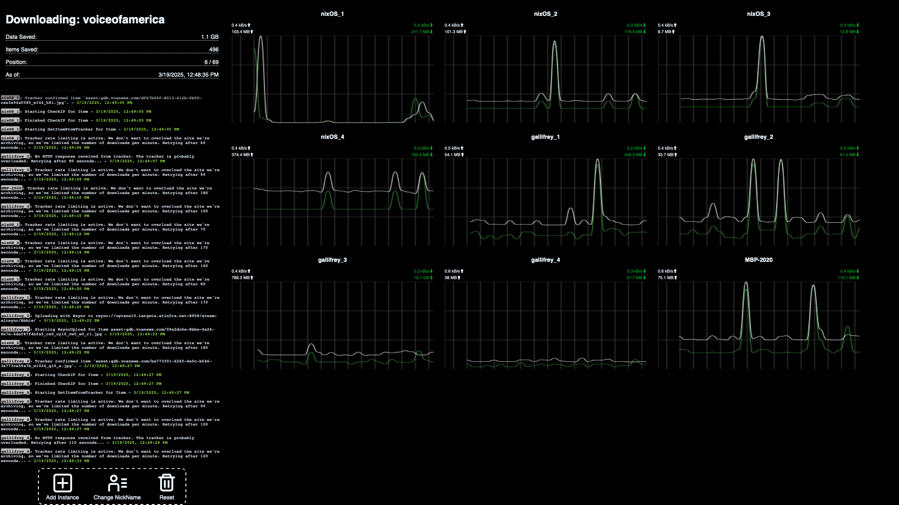

# Dashboard for Archive Team Warrior

You got all excited about setting up Archive Team Warrior instances and helping out, but it's too much of a pain to make sure everything is running properly?

I did, and instead of trying to hook into Grafana or any other more established solutions, I made my own.

## Features

* Reconnects to disconnected instances automatically.

* Instances having issues are highlighted in red.

* Pick one project to track and see your stats: how much data you've saved, and your position in the leaderboard.

* An aggregate log that shows your instances are in fact doing work. 

## Usage

* When the page loads, it will ask you for information. Enter the NickName you are using for your instances, and the name of the project (used in the tracker url). It's case sensitive.

* Enter your list of instance names and urls and press save. (Not: this list is not saved between sessions yet. If you have a large list of URLs, save it elsewhere to paste in).

* Manage your instance by clicking it's name, where you will be taken to it's normal management page where you can adjust settings or shut down.

* Enjoy your dashboard!

## Extra stuff

* Place custom styles in user.css

* Adjust colors in the console: Instance names are css classes in the log in the sidebar. Style a line for an instance using '#console p:has(.your-instance-name) {}'. The message text and timestamp are 'msg' and 'timestamp' respectively. The instance name itself is '.instName'

## ToDo

* Shutting down in-ui.

* Saving settings between sessions
